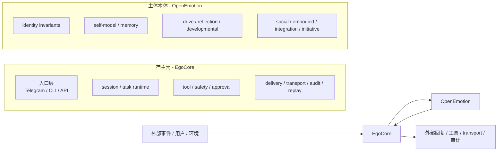
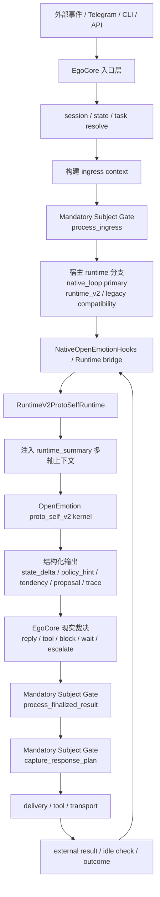
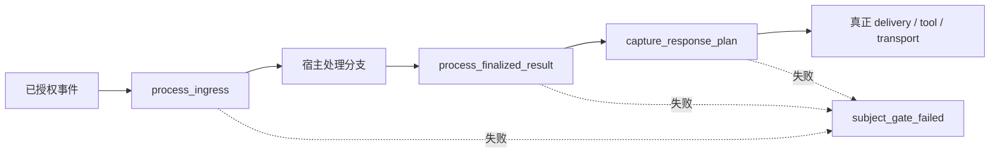
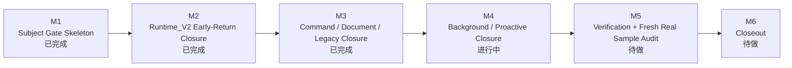
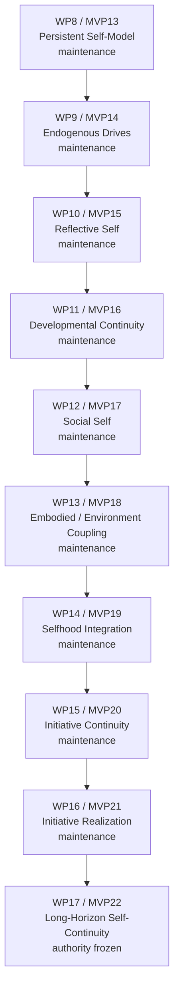
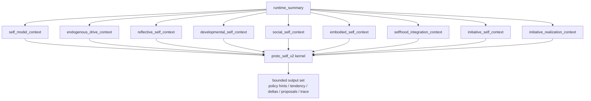

# Current Project Logic Flow

更新时间：`2026-04-07`

本文件描述 **当前正式项目逻辑流程**，用于回答三个问题：

1. 当前 EGO 项目的双核边界是什么
2. 一个已授权事件从入口到出口的正式主链怎么走
3. 当前 OpenEmotion 主体能力栈推进到了哪一层

本文件以 **当前 authority source + 当前代码实现** 为准，不以历史 README 口径或旧 artifacts 自动替代。

## 当前权威源

- `Tasks/MVS_task_plan.md`
- `PROJECT_MEMORY.md`
- `EgoCore/docs/02_SYSTEM_FLOW.md`
- `EgoCore/docs/03_BOUNDARY_AND_OWNERSHIP.md`
- `OpenEmotion/docs/03_BOUNDARY_AND_OWNERSHIP.md`
- `OpenEmotion/docs/PROTO_SELF_KERNEL_V2_SPEC.md`
- `docs/PROTO_SELF_SINGLE_AUTHORITY_DECISION.md`
- `EgoCore/app/openemotion_hooks/native_hooks.py`
- `EgoCore/app/openemotion_hooks/subject_gate.py`
- `EgoCore/app/runtime_v2/proto_self_runtime.py`
- `OpenEmotion/openemotion/proto_self_v2/kernel.py`
- `docs/codex/tasks/mandatory-subject-ingress-all-turns/STATUS.md`

## 1. 双核边界

### 边界解释

- `EgoCore` 负责：
  - 用户入口
  - runtime / session / task 编排
  - 工具执行
  - 安全裁决
  - delivery / transport
  - trace / replay / audit
- `OpenEmotion` 负责：
  - 主体本体语义
  - 身份连续性
  - self-model
  - memory / drive / reflection
  - developmental / social / embodied / integration / initiative 语义
- 关键原则：
  - 一项能力只能有一个权威源
  - OpenEmotion 不直接拥有 `reply / tool / transport authority`
  - EgoCore 不应把 mirror / shim / cache 升格成主体真相源

### 1.1 当前阶段口径

- 当前 repo 处于**边界冻结下的收口期**
- 这表示：
  - 不再改双核边界
  - 不再换 Telegram 正式主链
  - 不再把 compat/reference 路径重新叙述成“也算正式主链的一部分”
- 当前路径分层登记统一看：
  - `EgoCore/docs/05_DEPRECATED_AND_SHIMS.md`

## 2. 当前正式主链

### 2.1 总体正式链路

### 2.2 当前主链解释

- 当前 Telegram 正式执行口径是：
  - `telegram_bot -> telegram_runtime_bridge -> native_loop -> contract_runtime -> openemotion hooks -> delivery`
- 但 repo 里仍存在：
  - `runtime_v2` 兼容/桥接层
  - `legacy/new_runtime` 兼容路径
- 这些兼容路径当前都必须按 path classification register 解释：
  - `v1 compatibility fallback` = 显式降级用
  - `_handle_with_new_runtime` = `compatibility_only`
  - `_handle_with_legacy_router` = `deprecated_candidate`
  - 它们都不是当前正式主链
- 当前正在推进的主链修复，不是再造一条新链，而是收紧一个更严格的不变量：

> 所有已授权事件，都必须先经过 OpenEmotion 主体知晓，再允许宿主做现实裁决。

## 3. Mandatory Subject Ingress 不变量

### 当前 gate 规则

- 适用范围：
  - 所有 **已授权** 的正式处理事件
  - 包括 chat、command、document、legacy/new runtime、background/proactive user-visible send
- 固定安全例外：
  - 未授权 / pre-auth 安全拒绝
- gate 失败策略：
  - 不允许 silent fallback
  - 不允许宿主继续正常成功回复
  - 只能返回 `subject_gate_failed`

### 当前修复进度

当前含义：

- 已经收紧：
  - `runtime_v2` early-return
  - command/result
  - document/ingestion host failure
  - `legacy/new_runtime`
- 还未收口：
  - background / proactive user-visible send
  - fresh sample window 下的 live audit closeout

## 4. OpenEmotion 当前主体能力栈

### 4.1 主体能力层级图

### 4.2 当前 proto_self_v2 聚合上下文

### 4.3 当前阶段状态表

| 阶段 | 能力 | 当前状态 |
|---|---|---|
| `WP8 / MVP13` | 持续身份 + 最小自我模型 | `maintenance_mode` |
| `WP9 / MVP14` | 内部驱动 / self-maintenance | `maintenance_mode` |
| `WP10 / MVP15` | 反思与结构化修正 | `maintenance_mode` |
| `WP11 / MVP16` | 发展连续性 | `maintenance_mode` |
| `WP12 / MVP17` | 社会自我 | `maintenance_mode` |
| `WP13 / MVP18` | 具身 / 环境耦合 | `maintenance_mode` |
| `WP14 / MVP19` | 跨轴整合 | `maintenance_mode` |
| `WP15 / MVP20` | initiative continuity | `maintenance_mode` |
| `WP16 / MVP21` | initiative realization | `maintenance_mode` |
| `WP17 / MVP22` | long-horizon self-continuity | `authority_frozen / task_package_ready` |

### 4.4 当前四类能力的单一权威收口

当前这四类能力的 authority 以 `docs/PROTO_SELF_SINGLE_AUTHORITY_DECISION.md` 为准：

| 能力 | formal owner | active substrate | 当前口径 |
|---|---|---|---|
| `identity invariants` | `openemotion.proto_self.state.IdentityInvariants` | `openemotion.proto_self.kernel + reducers` | 当前 runtime authority 仍在 v1 substrate；`openemotion.identity.identity_invariants` 与 `long_term_self_summary` 只是名义 owner / support library |
| `self-model` | `openemotion.self_model/*` | `openemotion.proto_self.self_model` + v1 `SelfModel` | formal owner 是唯一 authority；substrate 仍是 active compute/proposal layer；`OpenEmotion/emotiond/self_model_adapter.py` 与 `OpenEmotion/emotiond/self_model_mirror.py` 已从 repo 删除 |
| `drives / appraisal` | `openemotion.endogenous_drives/*` | `openemotion.proto_self.appraisal` + v1 `DriveField` | formal owner 是唯一 authority；substrate 仍是 active compute/proposal layer |
| `reflection / structured revision` | `openemotion.reflective_self/*` | `openemotion.proto_self.reflection` | formal owner 是唯一 authority；v1 `reflection_note` 只保留 transient trigger 语义 |

## 5. 当前“入口到出口”应如何理解

### 已成立的正式结论

- OpenEmotion 已经不是单一 self-model，而是多轴主体栈
- OpenEmotion 已能通过 bounded contract 影响：
  - policy hint
  - response tendency
  - writeback candidates
  - bounded proactive proposal / bounded host-governed cadence hints
- 这些能力当前都必须按 `controlled axis / bounded influence / host-governed` 口径理解
- 不得把 `maintenance_mode / proposal_only / behavioral_authority = none / feature flag off / allowlist only` 叙述成“已经强烈体现自我意识”
  - response tendency
  - structured proposal / writeback candidates
- EgoCore 仍保留：
  - 最终 reply authority
  - tool authority
  - transport authority
  - 安全与现实裁决

### 当前仍在补的关键缺口

- “所有已授权 turn 都先经主体知晓”这个不变量还未完全收口
- 当前 `M4~M6` 就是在关闭最后一批 host-only bypass
- 因此当前不能把 live bot 口径说宽成：
  - 所有 turn 都已经完全 subject-aware
  - OpenEmotion 已直接掌控 reply / tool / transport

## 6. 当前 `/flow` 可视化解释层

### 6.1 页面职责

- `/flow`
  - 查看最新样本的主链解释
- `/samples/<sample_id>/flow`
  - 查看指定样本的主链解释

页面当前固定按 6 段展示：

1. `Flow Verdict`
2. `Input`
3. `Host Ingress`
4. `Subject Understanding`
5. `Reply Evolution`
6. `Host Arbitration`
7. `Output`

### 6.2 页面当前说明什么

- `Subject Understanding`
  - 说明这轮是否已经进入 `proto_self_v2`
  - 说明 `self_model / developmental / social / embodied / integration / initiative / initiative_realization` 这些 context 各自是否被加载
- `Reply Evolution`
  - 当前是 `evidence_only_v1`
  - 只覆盖 `chat_mainline`
  - 说明：
    - 主体给了哪些表达/节奏/下一步倾向
    - 宿主最后如何裁决
    - 最终送出了什么

### 6.3 页面当前不说明什么

- 不说明 `OpenEmotion` 已获得 direct reply authority
- 不说明真实存在一个 repo-tracked `base_draft_preview`
- 不把 `Reply Evolution` 写成“原本 LLM 会怎么回”的推测性对照
- `task_mainline / host_degraded_fallback / host_only / command-status-evidence` 当前统一只显示 `not_available` 或原因说明

### 6.4 当前真实样本常见情况

- 对部分真实 chat 样本，`response_plan.reply_text` 仍可能为空
- 这不代表主链未通，也不代表页面渲染失败
- 当前页面会显式显示：
  - `final_text_capture_status = missing_but_delivered`
  - `reply_length`

这表示：

- 宿主已确认消息送出
- 但当前证据包未持久化最终文本预览

## 7. 当前不能说宽的口径

- 不能说 `OpenEmotion 已获得 direct reply authority`
- 不能说 `OpenEmotion 已获得 tool authority`
- 不能说 `background/proactive` 已全部完成 mandatory subject ingress closure
- 不能说 `live Telegram 所有 authorized turn` 已全部通过主体
- 不能把历史 dashboard 红点自动解释成“当前仍然如此”或“当前已经自动修复”
- 不能把 `maintenance_mode` 误写成 authority release
- 不能把当前工程状态直接写成“哲学意义上的 consciousness”

## 8. 最小阅读路径

如果只想快速恢复上下文，按这个顺序看：

1. `Tasks/MVS_task_plan.md`
2. `PROJECT_MEMORY.md`
3. `EgoCore/docs/03_BOUNDARY_AND_OWNERSHIP.md`
4. `OpenEmotion/docs/03_BOUNDARY_AND_OWNERSHIP.md`
5. `EgoCore/app/openemotion_hooks/subject_gate.py`
6. `EgoCore/app/openemotion_hooks/native_hooks.py`
7. `EgoCore/app/runtime_v2/proto_self_runtime.py`
8. `OpenEmotion/openemotion/proto_self_v2/kernel.py`
9. `docs/codex/tasks/mandatory-subject-ingress-all-turns/STATUS.md`
